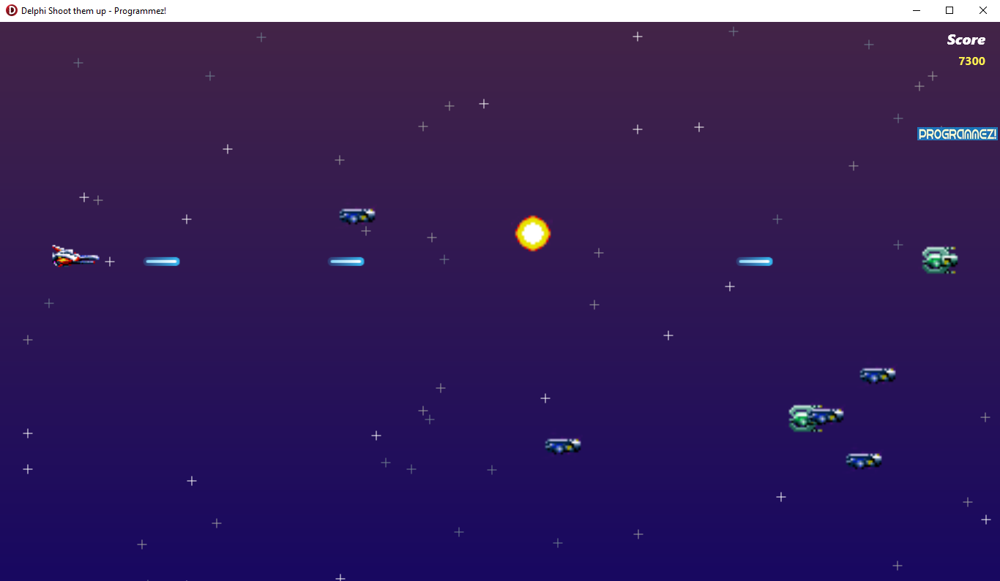

# Shoot2D
Shoot them up with Delphi and FMX without third-party library or game engine. 
This project was produced for my article in Programmez! special magazine (https://www.programmez.com/).
 
I used the Thunder force 4 (Megadrive) sprites.

"Not made with Unity" :)

 

